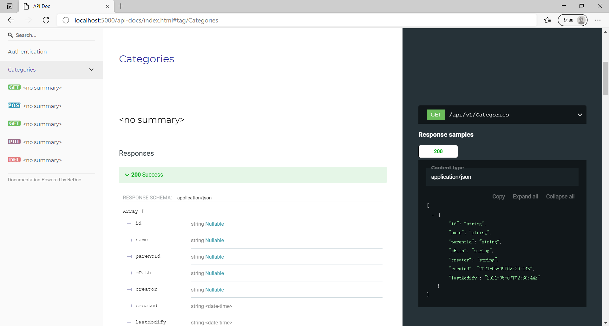

# 生成 RESTful 风格接口文档

> Swagger、Redoc 是基于 OpenAPI 规范的工具，例如生成 RESTful API 文档、API 调用等。

安装

```bash
dotnet add package Swashbuckle.AspNetCore --version 6.1.4
```

配置控制器分组，`GroupName`与`SwaggerDoc`中的`name`对应

```c#
[ApiExplorerSettings(GroupName = "v1")] // 指定控制器分组名称
[Route("api/v1/[controller]")]
[ApiController]
public class CategoriesController : ControllerBase
{

}
```

编辑项目文件，启用 XML 注释，并忽略 1591 警告码

```xml
<PropertyGroup>
  <GenerateDocumentationFile>true</GenerateDocumentationFile>
  <NoWarn>$(NoWarn);1591</NoWarn>
</PropertyGroup>
```

新建`ConfigureSwaggerOptions`类，配置 Swagger 文档信息

```c#
public class ConfigureSwaggerOptions : IConfigureOptions<SwaggerGenOptions>
{
    public void Configure(SwaggerGenOptions options)
    {
        // 这里可以定义一个或多个文档，比如v1、v2等等
        options.SwaggerDoc("v1", new OpenApiInfo
        {
            Title = "API Doc",
            Version = "v1"
        });

        // 描述 API 的身份验证
        options.AddSecurityDefinition("Bearer", new OpenApiSecurityScheme()
        {
            Name = "Authorization",
            Type = SecuritySchemeType.ApiKey,
            Description = "JWT Authorization header using the Bearer scheme. Example: \"Authorization: Bearer {token}\""
        });

        // 加载注释文件
        var files = new DirectoryInfo(AppContext.BaseDirectory).EnumerateFiles()
            .Where(f => f.Extension.Equals(".xml", StringComparison.OrdinalIgnoreCase));
        foreach (var fileInfo in files)
        {
            options.IncludeXmlComments(fileInfo.FullName);
        }
    }
}
```

注册 Swagger 生成器

```c#
public void ConfigureServices(IServiceCollection services)
{
    // Swagger 文档配置
    services.AddTransient<IConfigureOptions<SwaggerGenOptions>, ConfigureSwaggerOptions>();
    // 注册 Swagger 生成器
    services.AddSwaggerGen();

    services.AddControllers();
}
```

启用 Swagger、Swagger UI

```c#
public void Configure(IApplicationBuilder app, IWebHostEnvironment env)
{
    // 启用 Swagger 中间件，用于生成 JSON 端点
    app.UseSwagger();
    // 启用 Swagger UI
    app.UseSwaggerUI(options =>
    {
        options.SwaggerEndpoint("/swagger/v1/swagger.json", "API Doc");
        
        options.RoutePrefix = "api-docs";
    });

    app.UseRouting();

    app.UseEndpoints(endpoints =>
    {
        endpoints.MapControllers();
    });
}
```


启用 ReDoc UI

安装

```bash
dotnet add package Swashbuckle.AspNetCore.ReDoc --version 6.1.4
```

启用 Swagger、ReDoc UI

```c#
public class startup
{
  public void Configure(IApplicationBuilder app, IHostingEnvironment env)
  {
    // 启用 Swagger 中间件，用于生成 JSON 端点
    app.UseSwagger();
    // 启用 ReDoc UI
    app.UseReDoc(options =>
    {
      // 定义 Swagger 的 JSON 端点
      options.SpecUrl = "/swagger/v1/swagger.json";

      // API 文档的标题
      options.DocumentTitle = "Sample API";

      // API 文档的路由前缀
      options.RoutePrefix = "api-docs";
    }
  }
}
```


